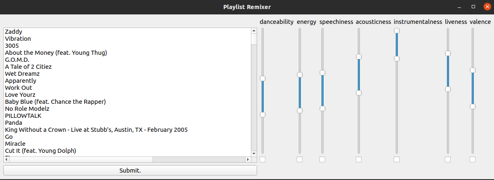

# Playlist_Remixer
This repository allows you to remix your Spotify playlist into a new playlist depending on certain song attributes that you can select. It also visualizes listening habits with a histogram and a list of averaged song statistics that varies by day. Lyrics are collected from genius.com and will be used for sentiment analysis and further feature gathering in the future.

Future Goals:
* Move from PyQt to Flask

Currently Being Implemented:
* Moving average of songs listened to
* Sentiment analysis of lyrics
* Improving framework structure

Major Frameworks: 
1. PyQt5
2. SQLite3
3. Spotipy

Status:
Functional - new features being implement and bug fixing
